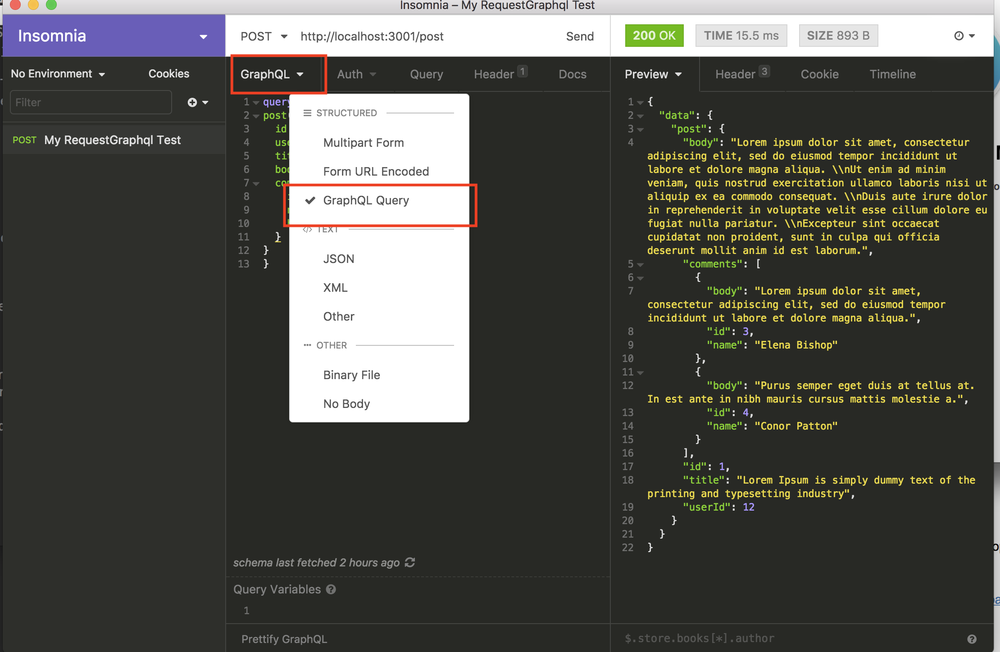

# Go GraphQL API


Creating a **Graphql** API with Go and PostgreSQL

## Installing Packages

Graphql

```
go get github.com/graphql-go/graphql
```

Graphql Handler 

```
go get github.com/graphql-go/graphql-go-handler
```


PosgreSQL

```
go get github.com/lib/pq
```

## Creating Database and Tables

##### Connect psql

```
psql -U <username>
```
 
##### Create Database 

```
CREATE DATABASE tutorials;
```

##### Create Post Table

```
CREATE TABLE IF NOT EXISTS "post" (
  id SERIAL PRIMARY KEY,
  userId INT,
  title TEXT,
  body TEXT
);
```

##### Create Comment Table

```
CREATE TABLE IF NOT EXISTS comment (
  id SERIAL PRIMARY KEY,
  postId INT,
  name   TEXT,
  email  TEXT,
  body   TEXT
);
```

##### INSERT Example Data

```
--- POST ---
INSERT INTO post (userId, title, body)
VALUES (12, 'Lorem Ipsum is simply dummy text of the printing and typesetting industry', 'Lorem ipsum dolor sit amet, consectetur adipiscing elit, sed do eiusmod tempor incididunt ut labore et dolore magna aliqua. \nUt enim ad minim veniam, quis nostrud exercitation ullamco laboris nisi ut aliquip ex ea commodo consequat. \nDuis aute irure dolor in reprehenderit in voluptate velit esse cillum dolore eu fugiat nulla pariatur. \nExcepteur sint occaecat cupidatat non proident, sunt in culpa qui officia deserunt mollit anim id est laborum.');

INSERT INTO post (userId, title, body)
VALUES (23, 'Section 1.10.32 of \"de Finibus Bonorum et Malorum\", written by Cicero in 45 BC', 'Sed ut perspiciatis unde omnis iste natus error sit voluptatem accusantium doloremque laudantium, totam rem aperiam, eaque ipsa quae ab illo inventore veritatis et quasi architecto beatae vitae dicta sunt explicabo. \nNemo enim ipsam voluptatem quia voluptas sit aspernatur aut odit aut fugit, sed quia consequuntur magni dolores eos qui ratione voluptatem sequi nesciunt. \nNeque porro quisquam est, qui dolorem ipsum quia dolor sit amet, consectetur, adipisci velit, sed quia non numquam eius modi tempora incidunt ut labore et dolore magnam aliquam quaerat voluptatem. \nUt enim ad minima veniam, quis nostrum exercitationem ullam corporis suscipit laboriosam, nisi ut aliquid ex ea commodi consequatur? \nQuis autem vel eum iure reprehenderit qui in ea voluptate velit esse quam nihil molestiae consequatur, vel illum qui dolorem eum fugiat quo voluptas nulla pariatur?');

INSERT INTO post (userId, title, body)
VALUES (43, '1914 translation by H. Rackham', 'But I must explain to you how all this mistaken idea of denouncing pleasure and praising pain was born and I will give you a complete account of the system, and expound the actual teachings of the great explorer of the truth, the master-builder of human happiness. \nNo one rejects, dislikes, or avoids pleasure itself, because it is pleasure, but because those who do not know how to pursue pleasure rationally encounter consequences that are extremely painful. \nNor again is there anyone who loves or pursues or desires to obtain pain of itself, because it is pain, but because occasionally circumstances occur in which toil and pain can procure him some great pleasure. \nTo take a trivial example, which of us ever undertakes laborious physical exercise, except to obtain some advantage from it? \nBut who has any right to find fault with a man who chooses to enjoy a pleasure that has no annoying consequences, or one who avoids a pain that produces no resultant pleasure?');

INSERT INTO post (userId, title, body)
VALUES (22, 'Maecenas nisl ante, tristique efficitur imperdiet sit amet, scelerisque a ex', 'Suspendisse dolor mi, ultrices et pulvinar porttitor, volutpat ac turpis. \nVestibulum ante ipsum primis in faucibus orci luctus et ultrices posuere cubilia Curae; Mauris at dignissim erat, semper vestibulum ligula. Suspendisse ac gravida eros. \nProin ut purus lacus. Morbi sodales euismod ornare. \nMaecenas venenatis nunc at rutrum pellentesque.');

INSERT INTO post (userId, title, body)
VALUES (14, 'Maecenas volutpat dolor enim', 'Nam ut urna imperdiet, viverra nunc ut, tincidunt eros. Nulla sit amet congue nunc. \nNunc feugiat feugiat turpis, non pharetra nisl tincidunt vel.');

INSERT INTO post (userId, title, body)
VALUES (11, 'Aenean quis ultrices sapien', 'Maecenas nisl ante, tristique efficitur imperdiet sit amet, scelerisque a ex. \nSuspendisse dolor mi, ultrices et pulvinar porttitor, volutpat ac turpis.');

INSERT INTO post (userId, title, body)
VALUES (13, 'Suspendisse ac gravida eros', 'Proin ut purus lacus. \nMorbi sodales euismod ornare. \nMaecenas venenatis nunc at rutrum pellentesque.');

INSERT INTO post (userId, title, body)
VALUES (56, 'Vestibulum fringilla venenatis ultricies', 'Fusce vehicula efficitur nibh, eget gravida purus consectetur sed. \nEtiam vitae commodo ligula, fermentum pellentesque diam.');

INSERT INTO post (userId, title, body)
VALUES (34, 'Morbi non magna non turpis feugiat semper in at tellus', 'Nulla semper viverra dolor, eget suscipit mauris varius in. \nVivamus felis neque, dapibus eu lacinia nec, feugiat tempor tellus.');
--- POST ---

--- Comments ---
INSERT INTO comment (postId, name, email, body)
VALUES (1, 'Johanna Hall', 'lthomas109@samohtodranoel.com','Nisi quis eleifend quam adipiscing vitae proin.');

INSERT INTO comment (postId, name, email, body)
VALUES (1, 'Kristine Steele', 'ityler172@relytlearsi.com','Excepteur sint occaecat cupidatat non proident, sunt in culpa qui officia deserunt mollit anim id est laborum.');

INSERT INTO comment (postId, name, email, body)
VALUES (1, 'Dillon Bates', 'jharrington4@notgnirrahsusej.com','Duis aute irure dolor in reprehenderit in voluptate velit esse cillum dolore eu fugiat nulla pariatur.);

INSERT INTO comment (postId, name, email, body)
VALUES (1, 'Elena Bishop', 'wdiaz353@zaidyelsew.org','Lorem ipsum dolor sit amet, consectetur adipiscing elit, sed do eiusmod tempor incididunt ut labore et dolore magna aliqua.');

INSERT INTO comment (postId, name, email, body)
VALUES (1, 'Conor Patton', 'mnorton444@notronaryam.com','Purus semper eget duis at tellus at. In est ante in nibh mauris cursus mattis molestie a.');
--- Comments ---

```

## Create Database Adapter

##### __database/adapter.go__

```
const (
	DATABASE_HOST      = "localhost"
	DATABASE_PORT      = 5432
	DATABASE_NAME      = "tutorials"
	DATABASE_USER_NAME = "ebubekirtabak"
	DATABASE_PASSWORD  = ""
)

func OpenDatabase() *sql.DB {

	psqlInfo := fmt.Sprintf("user=%s dbname=%s sslmode=disable",
		 DATABASE_USER_NAME, DATABASE_NAME)
	db, err := sql.Open("postgres", psqlInfo)
	if err != nil {
		log.Fatal(err)
	}

	return db
}

//database connection testing
func TestDatabase() {

	db := OpenDatabase()
	err := db.Ping()
	if err != nil {
		panic(err)
	}

	defer db.Close()
	fmt.Println("Successfully connected!")
}
```

## Create Types

#### Create Post Type

##### __types/post.go__

```
func CreatePostType(commentType *graphql.Object) *graphql.Object {
	return graphql.NewObject(graphql.ObjectConfig{
		Name: "Post",
		Fields: graphql.Fields{
			"id":     &graphql.Field{Type: graphql.Int},
			"userId": &graphql.Field{Type: graphql.Int},
			"title":  &graphql.Field{Type: graphql.String},
			"body":   &graphql.Field{Type: graphql.String},
			"comments": &graphql.Field{
				Type: graphql.NewList(commentType),
				Resolve: func(p graphql.ResolveParams) (interface{}, error) {
					post, _ := p.Source.(Post)
					return fetchCommentsByPostID(post.ID)
				},
			},
		},
	})
}

func FetchPostByiD(id int) (Post, error) {
	postData := Post{}
	db := database.OpenDatabase()
	defer db.Close()
	err := db.QueryRow(fmt.Sprintf("select id, userid, title, body from post where id='%d';",id)).Scan(&postData.ID, &postData.UserId, &postData.Title, &postData.Body)

	if err != nil {
		log.Fatal(err)
	}

	return postData,err
}
```

#### Create Comment Type

##### __types/comment.go__

```

type Comment struct {
	ID   	 int    `db:"id" json:"id"`
	PostId   int    `db:"postId" json:"postId"`
	Name 	 string `db:"name" json:"name"`
	Email 	 string `db:"email" json:"email"`
	Body     string `db:"body" json:"body"`
}

func CreateCommentType () *graphql.Object {
	return graphql.NewObject(graphql.ObjectConfig{
		Name: "Comment",
		Fields: graphql.Fields{
			"postid": &graphql.Field{
				Type: graphql.NewNonNull(graphql.Int),
			},
			"id": &graphql.Field{
				Type: graphql.NewNonNull(graphql.Int),
			},
			"name": &graphql.Field{
				Type: graphql.String,
			},
			"email": &graphql.Field{
				Type: graphql.String,
			},
			"body": &graphql.Field{
				Type: graphql.String,
			},
		},
	})
}

func fetchCommentsByPostID(id int) ([]Comment, error) {
	var response []Comment
	db := database.OpenDatabase()
	defer db.Close()
	rows, err := db.Query(fmt.Sprintf("SELECT id, postid, name, email, body FROM comment WHERE postid='%d'", id))
	common.CheckErr(err)
	isNext := true

	for rows.Next() {
		commentData := Comment{}
		isNext = false
		rows.Scan(&commentData.ID, &commentData.PostId, &commentData.Name, &commentData.Email, &commentData.Body)
		response = append(response, commentData)
	}

	if isNext {
		return nil, nil
	} else {
		return response, nil
	}
}
```

## Create Query Type 

##### __main.go__


```
func createQueryType(postType *graphql.Object) graphql.ObjectConfig {
	return graphql.ObjectConfig{Name: "QueryType", Fields: graphql.Fields{
		"post": &graphql.Field{
			Type: postType,
			Args: graphql.FieldConfigArgument {
				"id": &graphql.ArgumentConfig {
					Type: graphql.NewNonNull(graphql.Int),
				},
			},
			Resolve: func(p graphql.ResolveParams) (interface{}, error) {
				id := p.Args["id"]
				v, _ := id.(int)
				log.Printf("fetching post with id: %d", v)
				return types.FetchPostByiD(v)
			},
		},
	}}
}

```

###### Call Types

```

func createPostType(commentType *graphql.Object) *graphql.Object {
	return types.CreatePostType(commentType)
}

func createCommentType() *graphql.Object {
	return types.CreateCommentType()
}
```

## Run APi Server 

##### __main.go__

```
func main() {
	database.TestDatabase()
	database.OpenDatabase()
	schemaPost, err := graphql.NewSchema(graphql.SchemaConfig{
		Query: graphql.NewObject(
			createQueryType(
					createPostType(
					createCommentType(),
				),
			),

		),
	})

	if err != nil {
		log.Fatalf("failed to create schema, error: %v", err)
	}

	handlerPost := gqlhandler.New(&gqlhandler.Config {
		Schema: &schemaPost,
	})

	http.Handle("/post", handlerPost)
	log.Println("Server started at http://localhost:3001/post")
	log.Fatal(http.ListenAndServe(":3001", nil))
}
```

## Running 

I tested with Insomnia App.

Select Graphql Option.



Add query schema.

```
query {
post(id: 1) {
	id
	userId
	title
	body
	comments{
		id,
		name,
		body
	}
}
}
```

##### Conclusion

```
{
	"data": {
		"post": {
			"body": "Lorem ipsum dolor sit amet, consectetur adipiscing elit, sed do eiusmod tempor incididunt ut labore et dolore magna aliqua. \\nUt enim ad minim veniam, quis nostrud exercitation ullamco laboris nisi ut aliquip ex ea commodo consequat. \\nDuis aute irure dolor in reprehenderit in voluptate velit esse cillum dolore eu fugiat nulla pariatur. \\nExcepteur sint occaecat cupidatat non proident, sunt in culpa qui officia deserunt mollit anim id est laborum.",
			"comments": [
				{
					"body": "Lorem ipsum dolor sit amet, consectetur adipiscing elit, sed do eiusmod tempor incididunt ut labore et dolore magna aliqua.",
					"id": 3,
					"name": "Elena Bishop"
				},
				{
					"body": "Purus semper eget duis at tellus at. In est ante in nibh mauris cursus mattis molestie a.",
					"id": 4,
					"name": "Conor Patton"
				}
			],
			"id": 1,
			"title": "Lorem Ipsum is simply dummy text of the printing and typesetting industry",
			"userId": 12
		}
	}
}
```